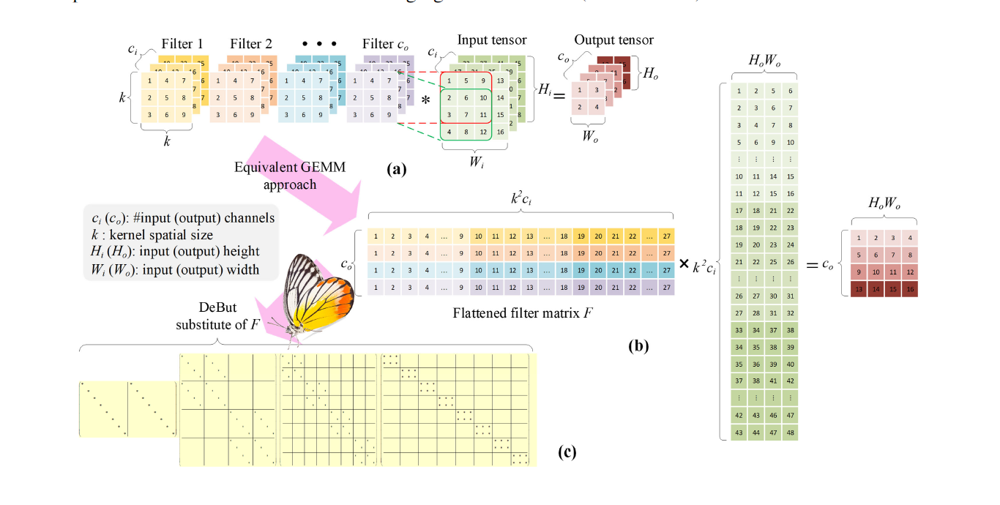
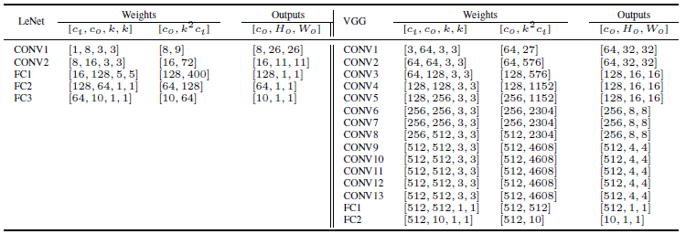
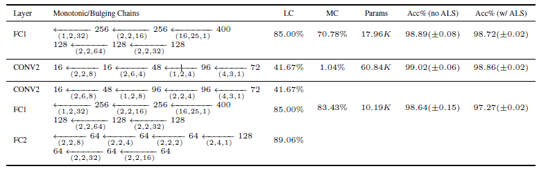
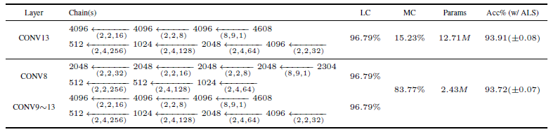
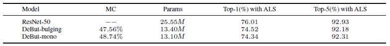
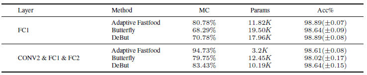
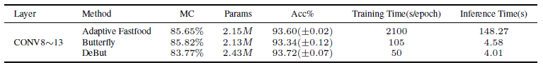

# Deformable Butterfly: A Highly Structured and Sparse Linear Transform

## DeBut


## Advantages
+ DeBut generalizes the square power of two butterfly factor matrices, which allows learnable factorized linear transform with strutured sparsity and flexible input-output size.
+ The intermediate matrix dimensions in a DeBut chain can either shrink or grow to permit a variable tradeoff between number of parameters and representation power.

## Running Codes
Our codes include **two parts**, namely: 1) ALS initialization for layers in the pretrained model and 2) fine-tuning the compressed modelwith DeBut layers. To make it easier to verify the experimental results, we provide the running commands and the corresponding script files, which allow the readers to reproduce the results displayed in the tables. 

We test our codes on Pytorch 1.2 (cuda 11.2). To install DeBut, run:
```
git clone https://github.com/RuiLin0212/DeBut.git
pip install -r requirements.txt
```

### Alternative Initialization (ALS)
This part of the codes aims to:
+ Verify whether the given chain is able to generate a dense matrix at the end.
+ Initialize the DeBut factors of a selected layer in the given pretrained model.

Besides, as anextension, ALS initialization can be used to approxiamte any matrix, not necessarily a certain layer of a pretrained model.

#### Bipolar Test
```
python chain_test.py \
--sup [superscript of the chain] \
--sub [subscript of the chain] \
--log_path [directory where the summaries will be stored]
```

We offer an example to check a chain designed for a matrix of size [512, 4608], run:
```
sh ./script/bipolar_test.sh
```

#### Layer Initialization
```
python main.py
--type_init ALS3 \
--sup [superscript of the chain] \
--sub [subscript of the chain] \
--iter [number of iterations, and 2 iterations are equal to 1 sweep] \
--model [name of the model] \
--layer_name [name of the layer that will be substituted by DeBut factors] \
--pth_path [path of the pretrained model] \
--log_path [directory where the summaries will be stored] \
--layer_type [type of the selected layer, fc or conv] \
--gpu [index of the GPU that will be used]
```

For LeNet, VGG-16-BN, and ResNet-50, we provide an example of one layer for each neural network, respectively, run:
```
sh ./script/init_lenet.sh \ # FC1 layer in the modified LeNet
sh ./script/init_vgg.sh \ # CONV1 layer in VGG-16-BN
sh ./script/init_resnet.sh # layer4.1.conv1 in ResNet-50
```

#### Matrix Approximation
```
python main.py \
--type_init ALS3 \
--sup [superscript of the chain] \
--sub [subscript of the chain] \
--iter [number of iterations, and 2 iterations are equal to 1 sweep] \
--F_path [path of the matrix that needs to be approximated] \
--log_path [directory where the summaries will be stored] \
--gpu [index of the GPU that will be used]
```

We generate a random matrix of size [512, 2048], to approximate this matrix, run:
```
sh ./script/init_matrix.sh 
```

### Fine-tuning
After using ALS initialization to get the well-initialized DeBut factors of the selected layers, we aim at fine-tuning the compressed models with DeBut layers in the second stage. In the following, we display the commands we use for LeNet@MNIST, VGG-16-BN@CIFAR-10, and ResNet-50@ImageNet, respectively. Besides, we give the scripts, which can run to reproduce our experimental results. It is worth noting that there are several important arguments related to the DeBut chains and initialized DeBut factors in the commands:
+ r_shape_txt: The path to .txt files, which describe the shapes of the factors in the given monotonic or bulging DeBut chains
+ debut_layers: The name of the selected layers, which will be substituted by the DeBut factors.
+ DeBut_init_dir: The directory of the well-initialized DeBut factors.

#### MNIST & CIFAR-10
For dataset MNIST and CIFAR-10, we train our models using the following commands.
```
–-log_dir [directory of the saved logs and models] n
–-data_dir [directory to training data] n
–-r_shape_txt [path to txt files for shapes of the chain] n
–-dataset [MNIST/CIFAR10] n
–-debut_layers [layers which use DeBut] n
–-arch [LeNet_DeBut/VGG_DeBut] n
–-use_pretrain [whether to use the pretrained model] n
–-pretrained_file [path to the pretrained checkpoint file] n
–-use_ALS [whether to use ALS as the initialization method]n
–-DeBut_init_dir [directory of the saved ALS files] n
–-batch_size [training batch] n
–-epochs [training epochs] n
–-learning_rate [training learning rate] n
–-lr_decay_step [learning rate decay step] n
–-momentum [SGD momentum] n
–-weight_decay [weight decay] n
–-gpu [index of the GPU that will be used]
```

#### ImageNet
For ImageNet, we use commands as below:
```
python train_imagenet.py n
-–log_dir [directory of the saved logs and models] n
–-data_dir [directory to training data] n
–-r_shape_txt [path to txt files for shapes of the chain] n
–-arch resnet50 n
–-pretrained_file [path to the pretrained checkpoint file] n
–-use_ALS [whether to use ALS as the initialization method]n
–-DeBut_init_dir [directory of the saved ALS files] n
–-batch_size [training batch] n
–-epochs [training epochs] n
–-learning_rate [training learning rate] n
–-momentum [SGD momentum] n
–-weight_decay [weight decay] n
–-label_smooth [label smoothing] n
–-gpu [index of the GPU that will be used]
```

#### Scripts
We also provide some examples of replacing layers in each neural network, run:
```
sh ./bash_files/train_lenet.sh n # Use DeBut layers in the modified LeNet
sh ./bash_files/train_vgg.sh n # Use DeBut layers in VGG-16-BN
553 sh ./bash_files/train_imagenet.sh n # Use DeBut layers in ResNet-50
```

## Experimental Results

### Architecture
We display the structures of the modified LeNet and VGG-16 we used in our experiments. Left: The modified LeNet with a baseline accuracy of 99.29% on MNIST. Right: VGG-16-BN with a baseline accuracy of 93.96% on CIFAR-10. In both networks, the activation, max pooling and batch normalization layers are not shown for brevity.



### LeNet Trained on MNIST
DeBut substitution of single and multiple layers in the modified LeNet. LC and MC stand for layer-wise compression and model-wise compression, respectively, whereas "Params" means the total number of parameters in the whole network. **These notations apply to subsequent tables.**



### VGG Trained on CIFAR-10
DeBut substitution of single and multiple layers in VGG-16-BN.



### ResNet-50 Trained on ImageNet
Results of ResNet-50 on ImageNet. DeBut chains are used to substitute the CONV layers in the last three bottleneck blocks.



### Comparison
#### LeNet on MNIST


#### VGG-16-BN on CIFAR-10


### Appendix
For more experimental details please check [Appendix](./fig_files/Appendix.pdf).

## License
DeBut is released under MIT License.

